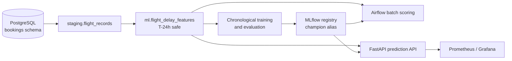

# FlightOps Sentinel

FlightOps Sentinel is an end-to-end machine-learning system for flight operations. It predicts the probability that a scheduled flight will depart **more than 15 minutes late**, giving operations teams a T-24h signal for where to focus attention.

The project is deliberately scoped to one decision: classify departure-delay risk for one scheduled flight, 24 hours before its scheduled departure. It is a portfolio-grade local platform and does not claim to be a production deployment.

## What the system does

1. Restores the PostgreSQL Airline Demo Database as the operational source.
2. Creates project-owned staging, analytics, and ML tables; it does not modify the source `bookings` schema.
3. Builds a leakage-safe feature mart using information available at the T-24h cutoff.
4. Trains and evaluates a binary classifier with chronological train, validation, and future-test windows.
5. Records datasets, parameters, metrics, models, and promotion decisions in MLflow.
6. Scores eligible flights in batch or through a FastAPI endpoint using the approved MLflow `champion` model.
7. Exposes health checks and Prometheus metrics for local operations.



## Project status

The repository contains the local database workflow, feature mart, training code, MLflow tracking, batch scoring, API, Airflow DAGs, Docker images, observability configuration, GitHub Actions, and Helm templates.

The model is promoted only when it beats the configured baseline on future-test ROC-AUC and PR-AUC. If no candidate qualifies, there is no `champion` model and prediction readiness correctly returns `503` rather than using an unapproved fallback.

## Prerequisites

- Python 3.12.10
- Docker Desktop
- At least 7 GB free disk space for the local source database and service volumes
- PowerShell on Windows

The source dataset is downloaded separately. It is about 558 MB compressed and remains Git-ignored under `data/`.

## Quick start

Run these commands from the repository root.

### 1. Configure Python and local secrets

```powershell
python -m venv .venv
.\.venv\Scripts\Activate.ps1
python -m pip install --upgrade pip
python -m pip install -e ".[dev]"

Copy-Item .env.example .env
```

Replace every `change-me` and `replace-with-*` value in `.env`. Never commit `.env`; it is ignored by Git.

### 2. Start infrastructure and restore the source database

```powershell
docker compose up -d postgres minio minio-init mlflow
.\scripts\download-demo-database.ps1
.\scripts\restore-demo-database.ps1
```

The restore script stops if a `demo` database already exists, avoiding an accidental overwrite of local data.

### 3. Create derived tables and features

```powershell
.\scripts\apply-migrations.ps1
.\scripts\refresh-staging.ps1
.\scripts\refresh-features.ps1
.\scripts\run-data-contracts.ps1
```

This creates and refreshes only the project-owned `staging`, `analytics`, and `ml` schemas.

### 4. Train a candidate

```powershell
.\.venv\Scripts\python.exe scripts\validate-training-data.py configs\training\logistic.yaml
.\.venv\Scripts\python.exe scripts\train-candidates.py configs\training\logistic.yaml
```

Available model configurations are `logistic`, `xgboost`, `lightgbm`, `random-forest`, and `extra-trees-balanced`. Each run logs to MLflow. An eligible run is registered and assigned the `champion` alias only after its PostgreSQL lineage record is saved.

### 5. Start the API and verify it

```powershell
docker compose up -d --build api
Invoke-WebRequest http://localhost:8000/health/live
```

The API requires a `champion` model. Once one exists, run the end-to-end check:

```powershell
.\scripts\smoke-test.ps1
```

The prediction endpoint is:

```text
POST /v1/predictions/flight-delay?flight_id={flight_id}
```

It returns the delay probability, risk level, timestamp, model name, and exact model version used for the prediction.

## Local services

| Service | Local address | Purpose |
| --- | --- | --- |
| PostgreSQL | `localhost:15432` | Source and project-owned relational data |
| MLflow | `http://localhost:5000` | Experiment tracking and model registry |
| FastAPI | `http://localhost:8000` | On-demand prediction and `/metrics` |
| Airflow | `http://localhost:8080` | Validation, feature, training, and batch DAGs |
| MinIO console | `http://localhost:9001` | Local MLflow artifact store |
| Grafana | `http://localhost:3300` | API observability dashboard |

Start Airflow after the source database, migrations, and feature mart are ready:

```powershell
docker compose up -d --build airflow-init airflow-api-server airflow-scheduler airflow-dag-processor
```

Use `docker compose down` to stop services while preserving volumes. Do not run `docker compose down -v` unless you intend to delete local data.

## Quality checks

```powershell
.\.venv\Scripts\python.exe -m ruff format --check .
.\.venv\Scripts\python.exe -m ruff check .
.\.venv\Scripts\python.exe -m mypy src
.\.venv\Scripts\python.exe -m pytest
```

GitHub Actions runs the same Python checks, Docker Compose/Helm validation, and Trivy scans. Merges to `main` build and scan immutable API, pipeline, and Airflow images for GHCR.

## Repository layout

```text
src/flightops/       Application, training, scoring, and pipeline code
sql/                 Migrations, feature SQL, and data-contract checks
airflow/dags/        Thin orchestration DAGs
configs/training/    Versioned model-family configurations
scripts/             Local setup, refresh, training, and smoke-test commands
docker/              Service images and observability configuration
deploy/              Helm chart and environment values
docs/                Contracts, runbooks, architecture, and decisions
tests/               Unit and regression tests
```

## Design rules

- Timestamps are timezone-aware.
- Training uses chronological splits, never random splits.
- Actual timestamps and final flight status never enter model features.
- The operational `bookings` schema remains read-only.
- API and batch scoring resolve the MLflow alias once and record the exact model version loaded.

## Documentation

| Topic | Document |
| --- | --- |
| Product scope and acceptance criteria | [prd.md](prd.md) |
| System design | [architecture.md](architecture.md) |
| Source and feature contracts | [data contract](docs/data-contract.md) · [feature contract](docs/feature-contract.md) |
| Training, evaluation, and model lifecycle | [training pipeline](docs/training-pipeline.md) · [MLflow lifecycle](docs/mlflow-lifecycle.md) |
| API behavior | [API contract](docs/api-contract.md) |
| Local setup and operations | [source database](docs/runbooks/local-source-database.md) · [local platform](docs/runbooks/local-platform.md) · [observability](docs/runbooks/observability.md) |
| CI/CD and Kubernetes | [CI/CD](docs/ci-cd.md) · [Minikube](docs/runbooks/minikube.md) |
| Known limitations and review findings | [production readiness](docs/production-readiness.md) · [Clean Code review](docs/clean-code-review.md) |

## Important limitations

The demo source is a historical snapshot. It does not include real-time weather, air-traffic control, crew, maintenance, or aircraft-rotation information. Schedule-congestion features assume schedules were published by the feature cutoff. The validation window is currently shared by tuning, calibration, and threshold selection; do not compare many candidate families against the same future test set without reserving a new holdout.
